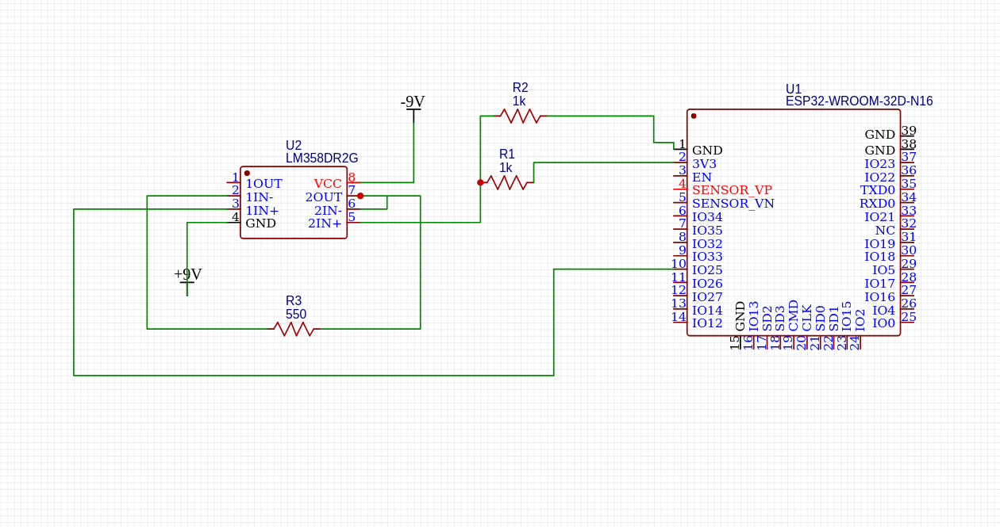

# GVS Interface

A high-performance Human-Machine Interface (HMI) designed to manipulate the human sense of balance using **Galvanic Vestibular Stimulation (GVS)**. By artificially modulating the tonic firing rate of the vestibular nerve, this system digitally induces the sensation of tilt, acceleration, and inertia without physical movement.

 **Status: 🚧 Active & In-Development**
> This project is continuously evolving. The current roadmap includes perfecting the hardware-software latency, exploring direct PC-gamepad integration, and developing real-world use cases for physical rehabilitation devices and immersive technology.

## 🚀 System Architecture
The project functions as a zero-latency digital-to-biological pipeline:

1. **The Input (UI):** A custom web-based controller captures human intent as a high-resolution 127-step vector.
2. **The Command Bridge:** A Python Flask backend receives the HTTP payload and instantly forwards the telemetry via **UDP protocol** to minimize network overhead and ensure zero-latency transmission.
3. **The Neural Engine:** An ESP32 receives the UDP packets and modulates a custom Op-Amp circuit using its internal 8-bit DAC. 
4. **The Analog Stage:** The circuit utilizes a **1.65V virtual ground** to allow bidirectional current flow (Cathodal/Anodal stimulation), enabling smooth, proportional control over the vestibular nerves.

## 📂 Repository Structure
* `/src`: Contains the ESP32 firmware, the Python Command Bridge, and the Web UI.
* `/hardware`: Contains circuit schematics, wiring logic, and analog math.
* `requirements.txt`: Python environment dependencies.

## 🚦 Deployment & Setup

### 1. Hardware & Firmware (ESP32)
To flash the firmware, you must have the **ESP32 Board Package** installed in your Arduino IDE (via the Boards Manager). Native WiFi libraries are utilized, so no additional Arduino libraries are required.
* Open `src/receiver.ino`.
* Update the Wi-Fi `ssid` and `password` variables.
* Flash to the ESP32 and open the Serial Monitor at `115200` baud to retrieve the local IP address.
* *Ensure your GVS electrodes are connected to the Op-Amp output and the 1.65V reference ground.*

### 2. The Python Command Bridge
Open your terminal, navigate to the project folder, and install the required Python dependencies. Then, start the command server:

```bash
# Install required Python libraries
pip install -r requirements.txt

# Run the Flask bridge (use sudo if your OS requires it for socket networking)
sudo -E python3 src/brain.py
```
* *Note: You must update the `ESP32_IP` variable inside `brain.py` to match the IP retrieved from the Arduino Serial Monitor.*

### 3. The Web Interface
Update the `BRIDGE_IP` variable inside `src/index.html` to match the local network IP of the laptop/machine running `brain.py`. Serve the HTML file or open it directly in a mobile browser connected to the same Wi-Fi network.

## 🔬 Hardware Evolution & Safety Architecture

Below is the initial bench-testing schematic of the GVS module. 



## ⚡ Hardware Connections & Electrode Placement
**CRITICAL SAFETY NOTE:** A 500-ohm safety resistor is required in series to limit maximum current.

* **Digital to Analog:** ESP32 DAC (Pin 25) drives the non-inverting input of the Op-Amp.
* **Completing the Circuit (Electrode Placement):** The Op-Amp A output and the inverting input connect directly to the user's **mastoid bone** (located just behind the ear) via surface electrodes to complete the circuit and stimulate the vestibular nerve.

> 🚨 **WARNING: Bench Prototype Only - Do Not Mimic Directly for Human Use.**
> The schematic above utilizes a dual-supply (+9V / -9V) configuration for the LM358 Op-Amp. While standard for general electronics, this presents a severe physiological hazard in a fault state. If the Op-Amp fails, it could dump up to 18mA through the user's tissue. 

To transition this design from a bench test to a wearable bio-interface, the following **Critical Safety Upgrades** must be implemented:

### 1. Hardware-Limited Power Supply
Because of our 1.65V Virtual Ground, this safely hardware-limits the absolute maximum fault current to <3mA, even in the event of a catastrophic chip failure.

### 2. Pull-to-Center Bias Resistor
Microcontroller DAC pins "float" while booting up. If the ESP32 is powered on but the code hasn't initialized, a floating pin acts like an antenna and can send unpredictable voltage spikes to the Op-Amp, resulting in sudden shocks. 
* **The Fix:** A `100kΩ` pull-to-center resistor is added between the ESP32 DAC pin (Pin 25) and the 1.65V Virtual Ground. This guarantees that during boot-up, the Op-Amp output perfectly matches the Virtual Ground (0V difference), ensuring absolute safety before the software takes over.

### 3. Physiological Fusing
For ultimate redundancy, a **3mA Fast-Blow Fuse** is added in series with the electrode output. If skin resistance drops unexpectedly (e.g., sweating) or a short circuit bypasses the 550Ω safety resistor, the fuse breaks the circuit instantly, physically severing the connection to the user.

## ⚠️ Challenges & Solutions
* **Network Latency:** Initial iterations used TCP/HTTP protocols, resulting in a noticeable delay between thumb movement and vestibular response. Swapping the ESP32 communication layer to **UDP** resolved this, prioritizing transmission speed over packet verification.
* **Biological Comfort:** Standard digital PWM signals caused sharp, uncomfortable jolts. Implementing an LM358 Op-Amp allowed us to output a smooth, true-analog voltage curve.

## 🏆 Project Origins & Awards
This system was originally conceptualized, prototyped, and built during **Hacknite**, a hackathon hosted at the International Institute of Information Technology Bangalore (IIITB).

* **Achievement:** 🥇 1st Place - IoT Track
* **Contributors:** Aaditya Khanna and Anand S.Menon

---
*Disclaimer: This project is a prototype for educational and experimental purposes in Human-Machine Interfacing. Proper isolation, current-limiting resistors (500Ω minimum), and safety protocols must be strictly adhered to when interfacing with biological systems.*
