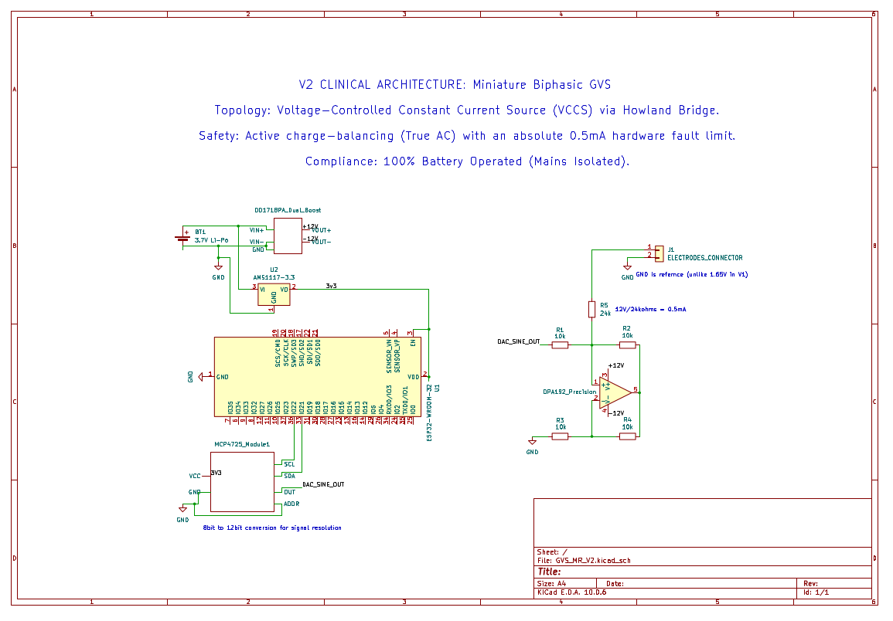
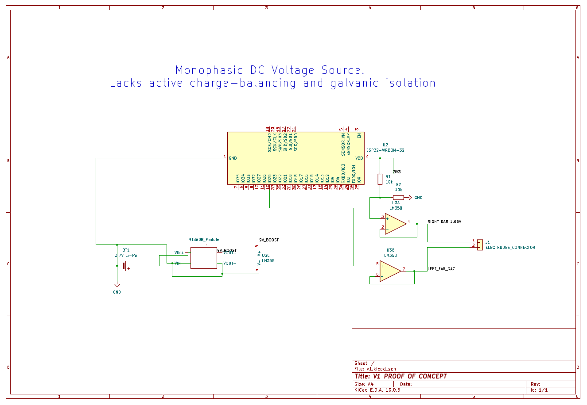
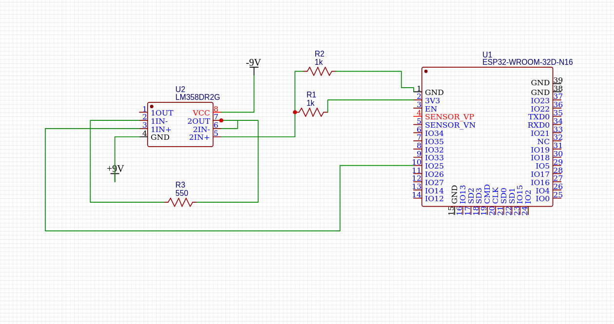

# Galvanic Vestibular Stimulation (GVS): Clinical Hardware Architecture

**Status: 🚧 Active Research & Hardware Development**

This repository documents the engineering progression of a miniature, battery-operated Galvanic Vestibular Stimulation (GVS) neural interface. The primary objective of this project is to develop a safe, sub-sensory, strictly charge-balanced hardware architecture capable of modulating the tonic firing rate of the vestibular nerve without inducing electrochemical hazards.

While the system includes a zero-latency UDP software telemetry bridge for control, the current development focus is strictly on **analog circuit design, physiological safety, and ethical stimulation protocols** necessary to transition from a theoretical proof-of-concept to a clinically viable medical device.

---

## 🔬 Clinical Safety & Ethical Design Directives

Interfacing directly with the human vestibular system requires absolute adherence to electro-physiological safety limits. A core focus of this repository is eliminating the risks associated with standard hobbyist electronics:
* **Strict Charge-Balancing (True AC):** Eliminating continuous direct current (DC) to prevent ion accumulation, localized tissue polarization, and chemical burns at the electrode-skin interface.
* **Voltage-Controlled Constant Current (VCCS):** Human skin impedance fluctuates wildly (e.g., due to perspiration). The hardware must dynamically adjust voltage to maintain a locked, predictable current output, neutralizing the risk of sudden current spikes.
* **Hardware-Level Fault Limits:** Software cannot be the sole safety barrier. The architecture enforces absolute maximum current limits via physical passive components to protect the user in the event of a microcontroller crash.

---

## 🛠️ Hardware Evolution & Schematic Log

The project's analog architecture is evolving iteratively to address strict clinical requirements. *Below is the current state of development, followed by archived legacy iterations.*

### Phase 2: Biphasic VCCS Architecture
**Status:** Active Theoretical Design & Electro-Mathematical Review

* **Architecture:** A complete topological overhaul shifting from a voltage source to a Voltage-Controlled Constant Current Source (VCCS) via a Howland Current Pump bridge. The design utilizes an OPA192 precision op-amp.
* **Signal Precision:** Waveform generation is offloaded to an external I2C 12-bit DAC (MCP4725) to ensure sub-sensory, high-resolution sine waves.
* **Power Topology:** Utilizes a dual-boost module (DD1718PA) to generate true +/-12V rails from a 3.7V Li-Po, establishing the groundwork for true AC charge-balancing. A 24kΩ limiting resistor was placed in series with the load to mathematically cap the maximum output at 0.5mA.
* **Identified Roadblocks for V3 PCB Revision:**
  Rigorous mathematical review of V2 flagged critical compliance issues currently being addressed for the next iteration:
  1. **Power Starvation:** The AMS1117-3.3 LDO regulator possesses a dropout voltage incompatible with Li-Po discharge curves, risking ESP32 brownouts. *Resolution: Migrating to a CMOS ultra-low dropout (LDO) regulator.*
  2. **The Biphasic Paradox:** V2 grounds the inverting pin. Because the DAC is unipolar (0-3.3V), the current cannot swing negative. *Resolution: Reintroducing the 1.65V virtual ground to shift the baseline for true AC output.*
  3. **Compliance Voltage Starvation:** Pushing 0.5mA through the 24kΩ safety resistor plus human skin resistance requires ~17V, which will clip on the +/-12V rails, introducing high-frequency harmonic distortion. *Resolution: Lowering the safety resistor and utilizing active diode clamping.*
  4. **Hardware DC-Blocking:** The architecture requires physical output capacitors to strictly block DC injection during a fault state.

### Phase 1: Monophasic Wearable Prototype
**Status:** Archived 

* **Architecture:** Transitioned to a fully portable wearable powered by a 3.7V Li-Po battery. Employed an MT3608 boost converter and established a 1.65V virtual ground using an LM358 op-amp to allow bidirectional control logic.
* **Clinical Limitations (Electrochemical Hazard):** The circuit functioned as a unipolar DC voltage source without active charge-balancing. Extended use risks severe skin polarization. Furthermore, operating as a voltage source meant any natural drop in skin resistance would result in an uncontrolled, hazardous spike in delivered current.

### Phase 0: Initial Bench Validation
**Status:** Archived (In-Vitro Testing Only)

* **Architecture:** A rudimentary unregulated voltage source utilizing an ESP32-WROOM-32D microcontroller and an LM358DR2G op-amp.
* **Power Supply:** Tethered to external +/- 9V bench power supplies.
* **Clinical Limitations:** This iteration lacked galvanic isolation, utilized a low-resolution internal 8-bit DAC (causing jagged, physically irritating voltage spikes), and possessed zero current-limiting mechanisms. Unsuitable for human deployment.

---

## 📡 Telemetry & Control Bridge

While hardware safety is the primary focus, the system relies on a high-performance digital pipeline for stimulus triggering:
* **The ESP32 Neural Engine:** Receives vector data via UDP protocols to ensure zero-latency execution.
* **Python Command Bridge:** A Flask-based backend captures user input and formats it into telemetry packets for the microcontroller.
* *(Note: Telemetry codebase is located in the `/src` directory, pending updates following the finalization of the V3 hardware architecture).*

---

## 🎓 Project Origins

This architecture was originally conceptualized and rapidly prototyped during Hacknite by Zense (by Aaditya Khanna and Anand S.Menon) at the International Institute of Information Technology, Bangalore (IIITB), where it was awarded 1st Place in the IoT Track. The project is currently being re-engineered by Aaditya Khanna to meet rigorous clinical safety standards.

> **Disclaimer:** This repository contains open-source schematics for educational and experimental purposes in neural interfacing and analog circuit design. Interfacing with biological systems carries inherent risks. Ethical safety protocols, galvanic isolation, and strict current-limiting hardware must be thoroughly validated prior to any in-vivo application.
